# Manuel Utilisateur - Angular Migration Planner

> **Guide d'utilisation pour planifier vos migrations Angular et Monorepo Nx / Angular Apps**

---

## 📑 Sommaire

### Navigation Rapide
- [⚠️ Limitations et Chantiers](#0-attention)
- [🚀 Vision Futur IA](#-8-futur--migration-automatique-par-ia)
- [❓ FAQ](#-9-faq)

### Sections Principales

**[📘 1. Introduction](#-1-introduction)**
- [Qu'est-ce que l'Angular Migration Planner ?](#quest-ce-que-langular-migration-planner-)
- [À qui s'adresse cet outil ?](#à-qui-sadresse-cet-outil-)
- [Bénéfices clés](#bénéfices-clés)

**[🚀 2. Installation et Premier Rapport](#-2-installation-et-premier-rapport)**
- [Prérequis](#prérequis) (Node.js 20+)
- [Installation](#installation) (Locale vs Globale)
- [Options Principales](#options-principales)
- [Exemples d'Utilisation](#exemples-dutilisation)
- [Ouvrir le Rapport Généré](#ouvrir-le-rapport-généré)
- [Compatibilité Automatique](#compatibilité-automatique)

**[📊 3. Page d'Accueil - Vue d'Ensemble](#-3-page-daccueil---vue-densemble)**
- [Informations Projet](#informations-projet)
- [Statistiques Globales](#statistiques-globales)
- [Cartes Applications et Bibliothèques](#cartes-applications-et-bibliothèques-nx-monorepo) (Nx)
- [Navigation](#navigation)

**[📈 4. Dashboard de Planification](#-4-dashboard-de-planification)**
- [4.1 Sélecteur de Migrations](#41-sélecteur-de-migrations)
- [4.2 Indicateurs Clés (KPIs)](#42-indicateurs-clés-kpis)
- [4.3 Graphiques Visuels](#43-graphiques-visuels)
- [4.4 Configuration Équipe](#44-configuration-équipe)
- [4.5 Timeline Gantt](#45-timeline-gantt)
- [4.6 Système de Filtres](#46-système-de-filtres)

**[📋 5. Hiérarchie et Règles](#-5-hiérarchie-et-règles)**
- [5.1 Structure Hiérarchique](#51-structure-hiérarchique) (Nx vs Standalone)
- [5.2 Cartes de Règles](#52-cartes-de-règles)
- [5.3 Édition des Temps](#53-édition-des-temps)
- [5.4 Bouton "Détails"](#54-bouton-détails)

**[📖 6. Guide de Migration](#-6-guide-de-migration)**
- [6.1 Page Guide Interactive](#61-page-guide-interactive)
- [6.2 Checklist par Priorité](#62-checklist-par-priorité)
- [6.3 Utilisation Pratique](#63-utilisation-pratique)

**[💡 7. Conseils d'Utilisation](#-7-conseils-dutilisation)**
- [Workflow Optimal](#workflow-optimal)
- [Scénarios d'Utilisation](#scénarios-dutilisation)
- [Interpréter les Résultats](#interpréter-les-résultats)

**[🚀 8. Futur : Migration Automatique par IA](#-8-futur--migration-automatique-par-ia)**
- [Vision et Objectifs](#vision-et-objectifs)
- [Moteur AST Déterministe](#moteur-ast-déterministe)
- [Données Structurées pour l'IA](#données-structurées-pour-lia)
- [Scénario d'Usage IA](#scénario-dusage-ia)
- [Exemple Concret](#exemple-concret)
- [Avantages](#avantages)
- [Roadmap](#roadmap)

**[❓ 9. FAQ](#-9-faq)**
- [Questions Fréquentes](#questions-fréquentes)
- Résolution de problèmes

**[📚 10. Glossaire](#-10-glossaire)**
- Termes techniques expliqués

**[🎯 11. Conclusion](#-11-conclusion)**
- Récapitulatif des bénéfices
- Prochaines étapes

---

##  0. ATTENTION

### Limitations (au 22/10/2025)

La précision actuelle du moteur AST au 22/10/2025 est encore en phase de test (alpha).

Malgré 450 tests unitaires actuellement vérifiant le moteur AST. Il se peut qu'il y ait des faux-positif & faux-négatif.

Les temps par chantier de migration sont encore à ajuster (même si un ajustement manuel est déjà à disposition).

Ces temps sont donc (en version Alpha) purement indicatif.

### Chantier à venir

De nouvelles releases sont à venir et amélioreront grandement la précision de l'outil.
Objectif de précision >= 95 %.

Ces améliorations arriveront courant des mois d'Octobre, Novembre et Décembre 2025.

### Pour le futur

Conseils : lire tout le document au préalable.

Voir cette section =>
[Futur](#-8-futur--migration-automatique-par-ia)
---

## 📘 1. Introduction

### Qu'est-ce que l'Angular Migration Planner ?

L'Angular Migration Planner est un outil professionnel qui **analyse automatiquement** votre projet Angular et calcule la charge de travail nécessaire pour migrer vers les versions 18, 19, 20 ou 21.

En quelques minutes, vous obtenez :
- 📊 Une estimation précise de la charge (en jours, heures et minutes)
- 📋 La liste complète des modifications à effectuer
- 🎯 Un dashboard visuel interactif pour planifier la migration
- ✅ Un guide étape par étape avec checklist

**Compatible automatiquement** avec :
- ✅ **Projets Angular Standalone** (application unique)
- ✅ **Monorepos Nx** (multiples apps et bibliothèques)

*Aucune configuration nécessaire, l'outil détecte automatiquement le type de projet !*

### À qui s'adresse cet outil ?

- **Tech Leads** planifiant des upgrades Angular
- **Développeurs** estimant l'effort de migration
- **Chefs de projet** évaluant la faisabilité et les délais

### Bénéfices clés

✨ **Gain de temps** : Analyse automatique en quelques minutes vs plusieurs jours d'audit manuel
🎯 **Précision** : Détection contextuelle éliminant les faux positifs
📊 **Visualisation** : Dashboard interactif pour communiquer avec les équipes
✅ **Priorisation** : Identification automatique des changements obligatoires vs optionnels

---

**[SCREENSHOT : Page d'accueil du rapport généré]**

---

## 🚀 2. Installation et Premier Rapport

### Prérequis

⚠️ **Node.js version 20 ou supérieure requise**

```bash
# Vérifier votre version de Node.js
node -v
# Doit afficher v20.x.x ou supérieur
```

Si votre version est inférieure à 20, [téléchargez la dernière version](https://nodejs.org/) ou utilisez nvm :

```bash
# Avec nvm
nvm install 20
nvm use 20
```

---

### Installation

Deux méthodes selon votre cas d'usage :

#### Méthode 1 : Installation Locale (Recommandée)

Installez l'outil dans le projet à analyser :

```bash
# Se placer à la racine du projet Angular
cd /chemin/vers/mon-projet-angular

# Installer en dépendance de développement
npm install -D @silvestv/migration-planificator

# Lancer l'analyse
npx migration-planificator
```

**Avantages** :
- ✅ Pas besoin de spécifier `--project-path`
- ✅ Version de l'outil trackée dans `package.json`
- ✅ Reproductible pour toute l'équipe

---

#### Méthode 2 : Installation Globale

Installez l'outil globalement sur votre machine :

```bash
# Installation globale
npm install -g @silvestv/migration-planificator

# Lancer l'analyse avec chemin du projet
migration-planificator --project-path=/chemin/vers/mon-projet
```

**Avantages** :
- ✅ Analyser n'importe quel projet sans installation locale
- ✅ Disponible dans tous vos terminaux

---

### Options Principales

```bash
# Mode d'analyse (par défaut : ast)
--scanner=ast          # Analyse précise (recommandé)
--scanner=both         # Mode comparatif (analyse AST + patterns textuels)

# Versions à analyser (par défaut : all)
--rules=18             # Seulement Angular 17→18
--rules=[18,19]        # Angular 17→18 + 18→19
--rules=all            # Toutes les migrations (17→18, 18→19, 19→20, 20→21)

# Chemin du projet (nécessaire si installation globale)
--project-path=/chemin/vers/projet
```

---

### Exemples d'Utilisation

#### Avec Installation Locale

```bash
# Analyse complète par défaut (AST + toutes migrations)
npx migration-planificator

# Migration ciblée vers Angular 18
npx migration-planificator --rules=18

# Analyse comparative complète
npx migration-planificator --scanner=both --rules=all
```

#### Avec Installation Globale

```bash
# Analyse complète avec chemin
migration-planificator --project-path=/mon/projet-angular

# Migration ciblée vers Angular 18
migration-planificator --rules=18 --project-path=/mon/projet-angular

# Analyse comparative complète
migration-planificator --scanner=both --project-path=/mon/projet-angular
```

---

**[SCREENSHOT : Commande dans le terminal avec progression de l'analyse]**

---

### Ouvrir le Rapport Généré

Une fois l'analyse terminée, le rapport HTML est disponible dans le dossier `output/` :

```bash
# macOS/Linux
open output/index.html

# Windows
start output/index.html
```

Le rapport s'ouvre directement dans votre navigateur par défaut.

### Compatibilité Automatique

L'outil **détecte automatiquement** le type de votre projet :

| Type Détecté | Comment ? | Résultat |
|--------------|-----------|----------|
| **Nx Monorepo** | Présence de `nx.json` | Analyse chaque app et lib séparément avec vue d'ensemble |
| **Angular Standalone** | Présence de `angular.json` uniquement | Analyse globale du projet comme une application unique |

**Aucune configuration manuelle requise !** L'interface s'adapte automatiquement.

---

**[SCREENSHOT : Message de détection automatique du type de projet]**

---

## 📊 3. Page d'Accueil - Vue d'Ensemble

La page d'accueil vous donne une **vue d'ensemble immédiate** de votre projet.

### Informations Projet

L'en-tête affiche :
- 📌 **Nom du projet** analysé
- 🔧 **Type** : Nx Monorepo ou Angular Standalone
- 📦 **Version Angular** actuelle détectée
- 📊 **Nombre d'applications/bibliothèques** (pour Nx uniquement)

---

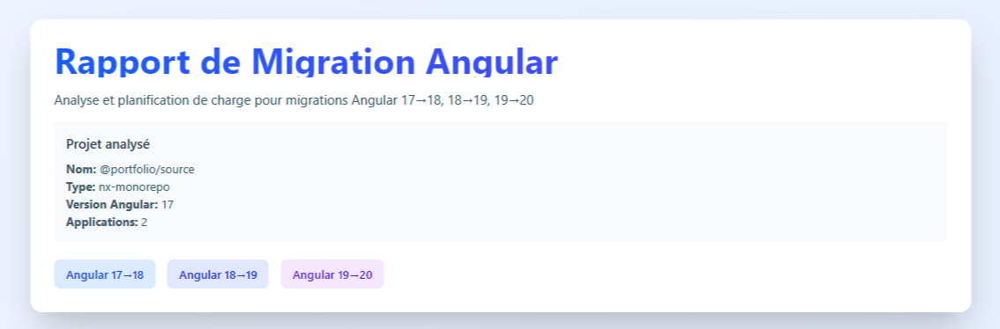

---

### Statistiques Globales

Quatre indicateurs clés vous donnent une vision instantanée :

| Indicateur | Signification |
|------------|---------------|
| **Charge totale** | Temps estimé pour réaliser toute la migration (jours/heures/minutes) |
| **Règles détectées** | Nombre de modifications différentes à appliquer |
| **Occurrences** | Instances de code à modifier dans tous les fichiers |
| **Fichiers concernés** | Nombre de fichiers de configuration impactés |

Ces chiffres vous permettent d'évaluer rapidement la complexité de la migration.

---

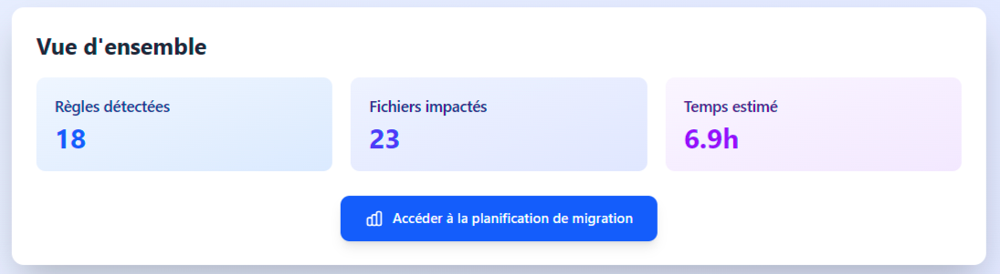

---

### Cartes Applications et Bibliothèques (Nx Monorepo)

Pour les monorepos Nx, chaque **application** et **bibliothèque** dispose de sa propre carte affichant :

- 🏷️ Nom de l'app ou lib
- ⏱️ Charge estimée spécifique
- 📋 Nombre de règles actives
- 🔗 Lien "Voir détails" vers l'analyse détaillée

**Pourquoi c'est utile ?**
Vous identifiez immédiatement les apps/libs les plus impactées et pouvez prioriser les efforts de migration.

---

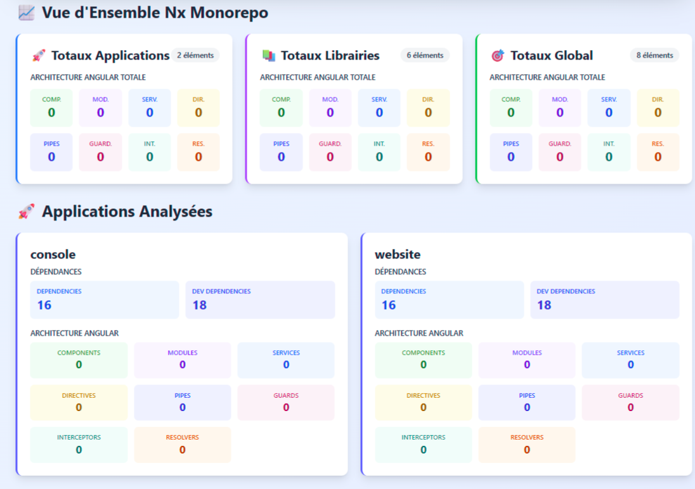

---

### Navigation

Deux boutons principaux vous permettent d'accéder aux fonctionnalités avancées :

- 📊 **Planificateur de Charge** : Dashboard interactif avec graphiques et Gantt
- 📖 **Guide de Migration** : Checklist étape par étape pour suivre la progression

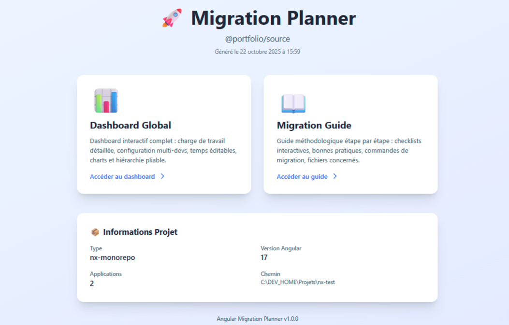

---

## 📈 4. Dashboard de Planification

Le Dashboard est le **cœur de l'outil**. Il vous permet de visualiser, filtrer, personnaliser et planifier votre migration en détail.

### 4.1 Sélecteur de Migrations

En haut du dashboard, vous pouvez **choisir quelles migrations inclure** :

- ☑️ **To 18** (Angular 17→18)
- ☑️ **To 19** (Angular 18→19)
- ☑️ **To 20** (Angular 19→20)
- ☑️ **To 21** (Angular 20→21)
- 🔘 Bouton **"Toutes"** pour sélectionner/désélectionner tout

**Impact en temps réel** : Dès que vous changez la sélection, les KPIs, graphiques, hiérarchie et Gantt se mettent à jour automatiquement.

**Cas d'usage** :
Si vous souhaitez uniquement migrer vers Angular 18 dans un premier temps, décochez To19 et To20 pour voir uniquement les changements nécessaires.

---

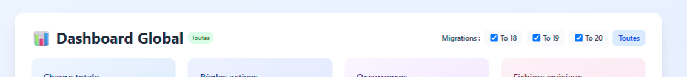

---

### 4.2 Indicateurs Clés (KPIs)

Quatre grandes cartes affichent les métriques principales :

| KPI | Description | Exemple |
|-----|-------------|---------|
| **Charge totale** | Temps de travail estimé total | `12j 3h 45min` |
| **Règles actives** | Nombre de règles de migration détectées | `42` |
| **Occurrences** | Instances de code à modifier | `1 247` |
| **Fichiers spéciaux** | Fichiers de configuration concernés | `18` |

Ces indicateurs se mettent à jour automatiquement selon :
- ✅ Les migrations sélectionnées
- ✅ Le nombre de développeurs configuré
- ✅ Les temps personnalisés que vous avez modifiés

---

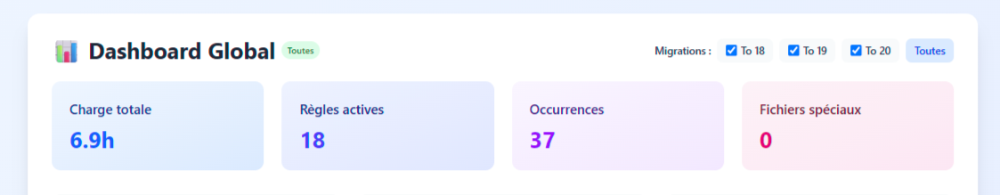

---

### 4.3 Graphiques Visuels

Le Dashboard affiche **4 graphiques interactifs** pour visualiser la répartition de la charge.

#### 📊 Répartition par Migration

Graphique circulaire montrant la **distribution de la charge** entre To18, To19 et To20.

**Ce que vous apprenez** :
Quelle migration demande le plus d'effort ? Est-ce équilibré ou concentré sur une version ?


#### 📊 Répartition par Apps & Libs (Nx uniquement)

Graphique circulaire montrant la **distribution de la charge** dans votre monorepo.

**Ce que vous apprenez** :
Quelles applications ou bibliothèques sont les plus impactées ? Où concentrer les efforts ?


#### 📊 Par Priorité

Graphique circulaire montrant la **répartition** entre :
- 🔴 **Obligatoire** (changements critiques)
- 🟡 **Recommandé** (améliorations importantes)
- 🟢 **Optionnel** (optimisations)

**Ce que vous apprenez** :
Quelle part de la migration est incompressible (obligatoire) vs améliorations optionnelles ?

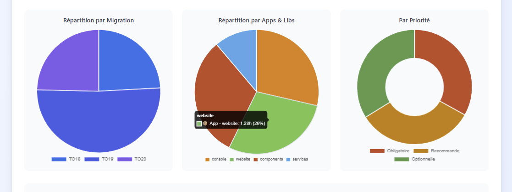

#### 📊 Top 10 Règles

Graphique en barres horizontal montrant les **10 règles les plus fréquentes** dans votre code.

**Fonctionnalités** :
- Bouton **"Voir détails"** pour afficher 20 règles au lieu de 10
- Identification rapide des patterns récurrents

**Ce que vous apprenez** :
Quels patterns de code sont les plus utilisés dans votre projet ? Où sont les plus gros volumes de modifications ?

---

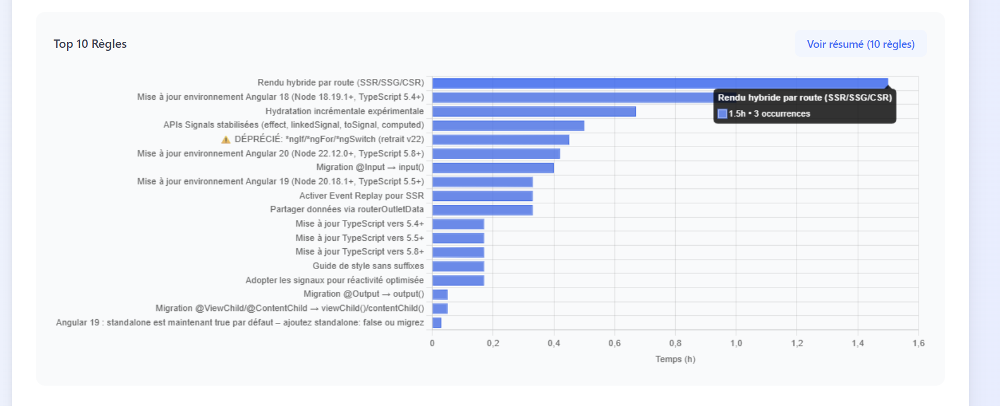

---

### 4.4 Configuration Équipe

Cette section vous permet d'**ajuster les paramètres de planification** selon votre contexte.

#### Paramètres Modifiables

| Paramètre | Description | Valeurs |
|-----------|-------------|---------|
| **Date de départ** | Quand commence la migration ? | Date au format calendrier |
| **Nombre de développeurs** | Combien de personnes dans l'équipe ? | 1 à 20 |
| **Heures par jour** | Temps dédié par jour à la migration | 1 à 10h (défaut : 7h) |

#### Calcul Automatique

Dès que vous modifiez un paramètre, le **temps ajusté** s'affiche :

> **Temps ajusté : 8j 2h (3 développeurs)**

**Comment ça marche ?**
- Les tâches **obligatoires** 🔴 s'exécutent **séquentiellement** (non parallélisables)
- Les tâches **recommandées** 🟡 et **optionnelles** 🟢 sont **parallélisables** (divisées par le nombre de devs)
- Les tâches **routines** (configuration projet) sont également **parallélisables**

**Exemple concret** :
Si vous avez 20 jours de tâches obligatoires et 60 jours de tâches recommandées, avec 3 développeurs :
- Obligatoires : 20 jours (séquentiels)
- Recommandées : 60 / 3 = 20 jours (parallèle)
- **Total : 40 jours** au lieu de 80 jours

---

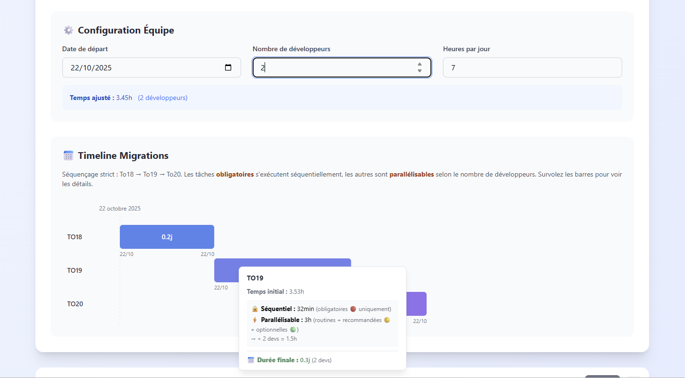

---

### 4.5 Timeline Gantt

La timeline Gantt offre une **visualisation temporelle réaliste** de votre migration.

#### Fonctionnalités Clés

**Barres de Progression**
Trois barres séquentielles pour To18, To19, To20 avec dates de début/fin.

**Calendrier Réel**
- Grille temporelle avec dates formatées (DD/MM/YYYY)
- Calcul sur **jours ouvrés uniquement** (exclut samedi/dimanche)
- Indicateur de weekend : icône pause ⏸ sur les barres

**Séquençage Strict**
Les migrations s'exécutent dans l'ordre : **To18 → To19 → To20 → To21**
La To19 ne peut commencer qu'après la fin de la To18, etc.

#### Tooltips au Survol

Survolez une barre pour voir les détails complets :

| Information | Description |
|-------------|-------------|
| **Nom migration** | To18, To19 ou To20 |
| **Temps initial** | Avant parallélisation |
| **Temps séquentiel** | Tâches obligatoires uniquement |
| **Temps parallélisable** | Recommandées + Optionnelles + Routines |
| **Durée finale** | En jours après ajustement devs |

**Ce que vous apprenez** :
Dates de début et fin réalistes, impact de la parallélisation, répartition entre tâches critiques et améliorations.

---

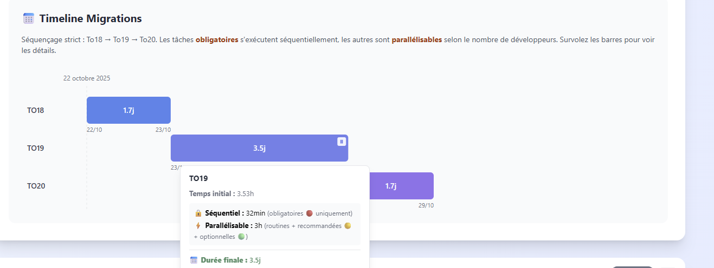

---

### 4.6 Système de Filtres

Le système de filtres vous permet de **concentrer votre attention** sur les règles pertinentes.

#### Panel Accordion Pliable

Le panel de filtres est **pliable/dépliable** en cliquant sur l'en-tête.

**Affichage permanent** :
- 🏷️ **Chips des filtres actifs** (ex: "🔴 Critical", "Template")
- 📊 **Compteur** : `12 / 85 règles` (règles visibles / total)
- ⬅️➡️ **Navigation** : Boutons Précédent/Suivant entre règles filtrées
- 🗑️ **Bouton "Effacer"** : Réinitialiser tous les filtres

---

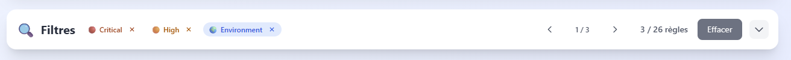

---

#### Types de Filtres Disponibles

##### 1️⃣ Recherche Textuelle

Saisissez du texte pour chercher une règle par son nom (ex: "ngIf", "router").

##### 2️⃣ Niveau de Risque

| Niveau | Signification |
|--------|---------------|
| 🔴 **Critical** | Changements bloquants (build échoue sans ça) |
| 🟠 **High** | Dépréciations majeures (fonctionne mais obsolète) |
| 🟡 **Medium** | Améliorations importantes (recommandé fortement) |
| 🟢 **Low** | Optimisations (peut attendre) |

##### 3️⃣ Catégorie

- **Environment** : Versions Node.js, TypeScript
- **Imports** : Modules et imports Angular
- **API** : Fonctions et services Angular
- **Routing** : Router et navigation
- **Template** : Directives HTML et syntaxe
- **Test** : Tests unitaires et e2e
- **SSR** : Server-Side Rendering

##### 4️⃣ Type de Règle

| Type | Description |
|------|-------------|
| **Standard** | Modifications de code classiques (occurrences × temps) |
| **Routine** | Tâches manuelles projet (ex: upgrade Node.js) - 1 fois par projet |
| **Special** | Comptage de fichiers de configuration |
| **Combined** | Mixte (occurrences + fichiers) |

---

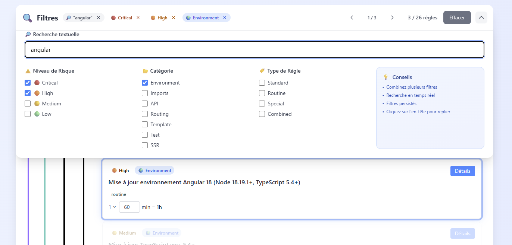

---

#### Persistance et Actions

✅ **Sauvegarde automatique** : Les filtres sont sauvegardés entre les sessions (LocalStorage)
🗑️ **Bouton "Effacer"** : Réinitialise tous les filtres en un clic
⬅️➡️ **Navigation** : Parcourez les règles filtrées avec les flèches

---

## 📋 5. Hiérarchie et Règles

La hiérarchie vous permet d'**explorer les règles de migration** de manière organisée.

### 5.1 Structure Hiérarchique

L'arborescence s'adapte automatiquement au type de projet.

#### Pour Monorepo Nx

```
📦 Projet Monorepo
├── 📱 Applications
│   ├── 🔷 App 1
│   │   ├── 🔵 To18
│   │   │   ├── 🔴 Obligatoire (12 règles)
│   │   │   ├── 🟡 Recommandé (8 règles)
│   │   │   └── 🟢 Optionnel (5 règles)
│   │   ├── 🟣 To19
│   │   └── 🟪 To20
│   └── 🔷 App 2
└── 📚 Bibliothèques
    └── 🔶 Lib 1
```

---

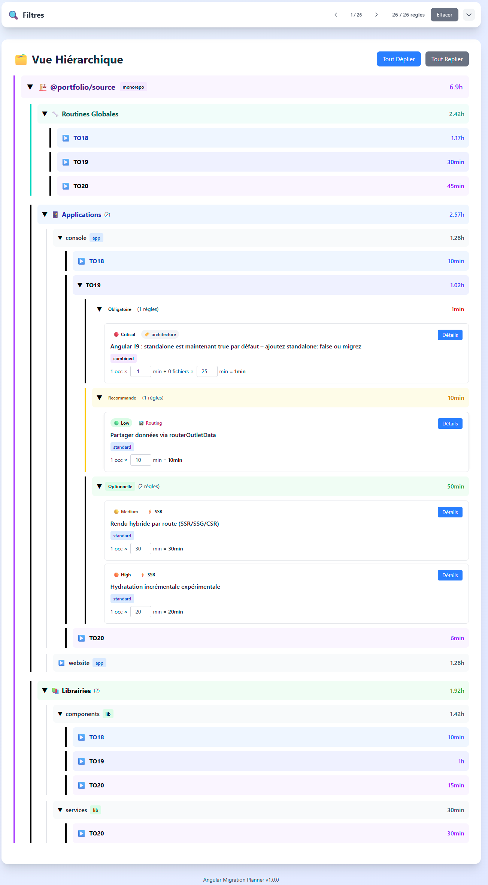

---

#### Pour Angular Standalone

```
📦 Projet Application
├── 🔵 To18
│   ├── 🔴 Obligatoire (15 règles)
│   ├── 🟡 Recommandé (10 règles)
│   └── 🟢 Optionnel (7 règles)
├── 🟣 To19
└── 🟪 To20
```

#### Navigation Intuitive

**Expandre/Réduire les sections** :
- Cliquer sur une section pour l'ouvrir ou la fermer
- Icônes **▼** (ouvert) et **▶** (fermé)

**Couleurs par migration** :
- 🔵 **Bleu** pour To18
- 🟣 **Indigo** pour To19
- 🟪 **Violet** pour To20

**Couleurs par priorité** :
- 🔴 **Rouge** pour Obligatoire
- 🟡 **Jaune** pour Recommandé
- 🟢 **Vert** pour Optionnel

---

### 5.2 Cartes de Règles

Chaque règle est affichée dans une **carte détaillée**.

#### Informations Affichées

**En-tête de carte** :
- 🏷️ **Badges colorés** : Niveau de risque, Catégorie, Type de règle
- 📝 **Titre clair** : Ex: "Remplacer *ngIf par @if"

**Corps de carte** :
- 🧮 **Formule de calcul** : Comment le temps est calculé
- ⏱️ **Temps estimé** : Résultat final pour cette règle

---

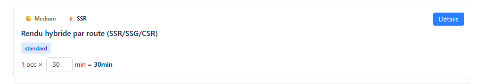

---

#### Formules selon le Type

##### Type Standard

```
12 occurrences × 5 min = 1h
```

**Signification** : 12 instances de code trouvées, 5 minutes de modification par instance.

##### Type Routine

```
1 tâche × 30 min = 30min
```

**Signification** : Tâche unique par projet (ex: mise à jour Node.js vers version 18).

##### Type Special

```
8 fichiers × 10 min = 1h 20min
```

**Signification** : 8 fichiers de configuration trouvés (ex: `environment.*.ts`), 10 minutes par fichier.

##### Type Combined

```
(12 occ × 5 min) + (8 fichiers × 10 min) = 2h 20min
```

**Signification** : Modifications de code (12 occ) + fichiers de configuration (8 fichiers).

---

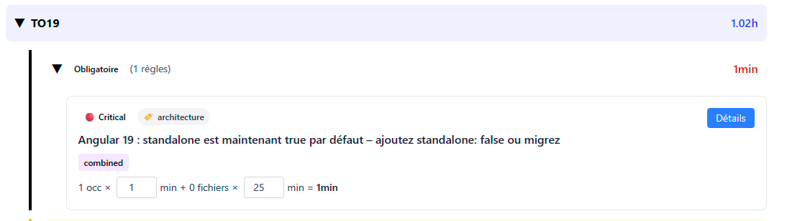

---

### 5.3 Édition des Temps

Vous pouvez **personnaliser les estimations de temps** pour les adapter à votre contexte.

#### Comment Modifier ?

1. **Cliquer** sur le temps unitaire dans la formule (ex: cliquer sur `5` dans `12 occ × 5 min`)
2. **Saisir** la nouvelle valeur en minutes
3. **Valider** en appuyant sur Entrée ou en cliquant ailleurs

#### Recalcul Automatique

Dès la modification :
- ✅ Le temps de la règle se met à jour instantanément
- ✅ Propagation **hiérarchique** :
    - Temps de la règle → Temps de la priorité → Temps de la migration → Temps du target → Temps total projet
- ✅ Les **KPIs** et **graphiques** s'actualisent en temps réel
- ✅ Le **Gantt** se recalcule avec les nouvelles dates

#### Bouton Reset

Chaque règle modifiée dispose d'un **bouton "Reset"** pour revenir au temps d'origine.

---

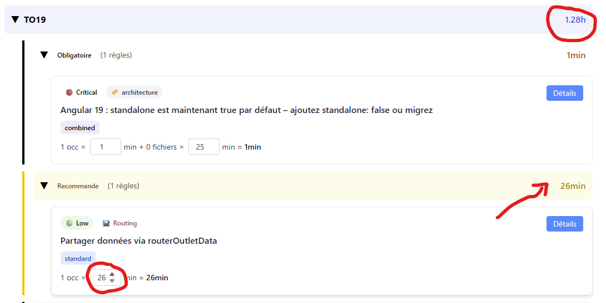

---

#### Pourquoi Personnaliser ?

Les temps par défaut sont des **moyennes**. Personnalisez-les pour :
- ✅ **Tenir compte de la complexité** : Code legacy vs code récent
- ✅ **Adapter à l'expérience** : Équipe junior vs équipe senior
- ✅ **Refléter votre contexte** : Tests complets vs tests partiels
- ✅ **Affiner l'estimation** : Après avoir testé quelques règles

---

### 5.4 Bouton "Détails"

Chaque carte de règle dispose d'un **bouton "Détails"** pour accéder aux informations complètes.

#### Contenu du Modal

En cliquant sur "Détails", un modal s'ouvre avec :

| Section | Contenu |
|---------|---------|
| **Description** | Explication complète en français : pourquoi ce changement, quel impact |
| **Exemples de code** | Code "Avant" et "Après" migration avec mise en évidence |
| **Commande de migration** | Commande Angular CLI automatique (si disponible) |
| **Documentation** | Liens vers la documentation officielle Angular |
| **Fichiers impactés** | Liste complète avec localisation précise (ligne:colonne) et extraits |
| **Métadonnées** | Auto-fixable ?, Temps unitaire, Type de règle, Total occurrences |

---

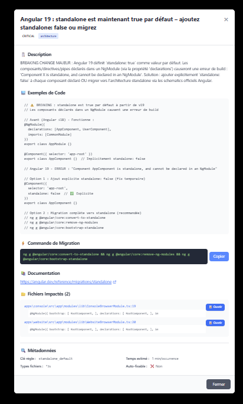

---

#### Utilisation Pratique

**Copier la commande** :
Cliquez sur le bouton "Copier" à côté de la commande de migration pour la coller dans votre terminal.

**Consulter les fichiers** :
La liste des fichiers impactés vous permet de savoir exactement où intervenir. Cliquez sur le chemin pour le copier.

**Comprendre le contexte** :
Les exemples "Avant/Après" et la description détaillée vous expliquent pourquoi et comment migrer.

---

## 📖 6. Guide de Migration

Le Guide de Migration est une **checklist interactive** pour suivre votre progression pas à pas.

### 6.1 Page Guide Interactive

#### Sélecteur de Version

En haut de la page, choisissez la migration à suivre :
- **To18** : Angular 17→18
- **To19** : Angular 18→19
- **To20** : Angular 19→20
- **To21** : Angular 20→21

Seules les règles de la migration sélectionnée s'affichent.

#### Barre de Progression

La barre de progression indique votre avancement :

```
████████░░░░░░░░░░░░  35% - 12 / 35 règles complétées
```

**Fonctionnalités** :
- ✅ Compteur visuel avec pourcentage
- ✅ Barre verte qui se remplit
- 🔄 **Bouton "Réinitialiser"** pour recommencer à zéro

---

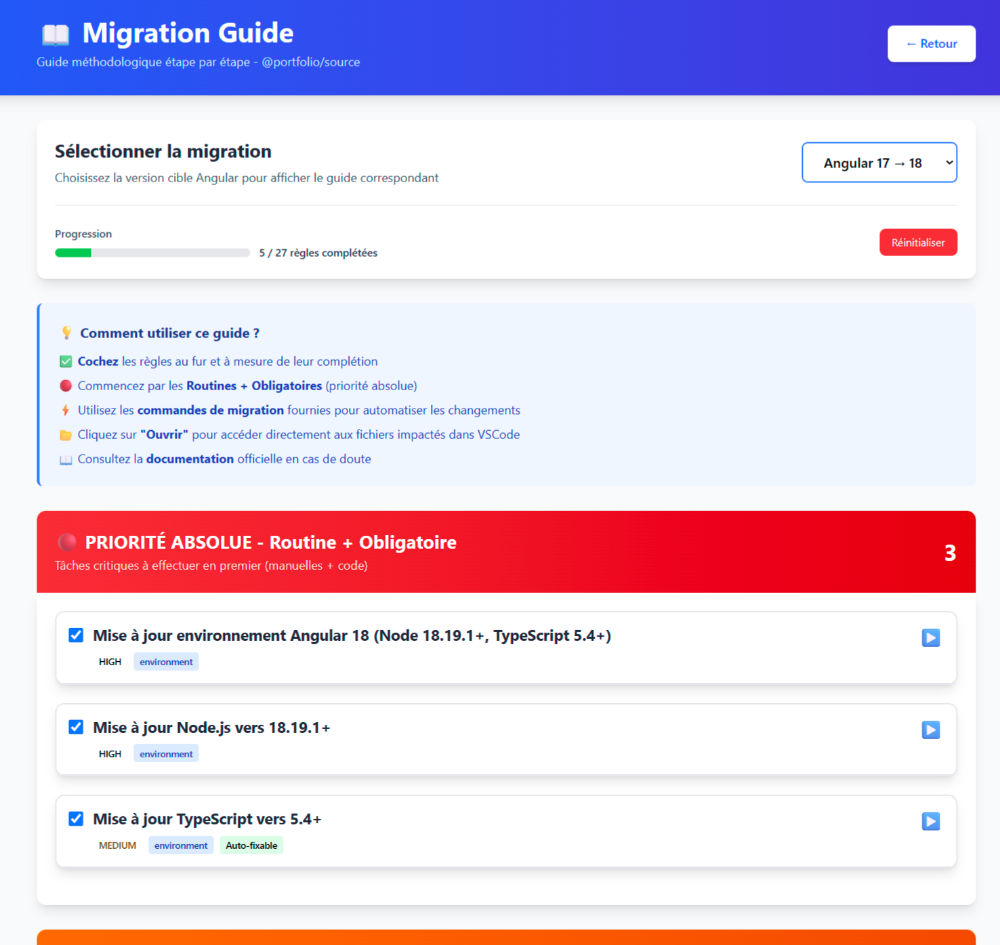

---

### 6.2 Checklist par Priorité

Les règles sont **organisées par priorité** pour vous guider dans l'ordre logique.

#### Organisation

1. **Règles Obligatoires** 🔴 🟠 (en premier)
   Changements critiques sans lesquels la migration échoue.

2. **Règles Recommandées** 🟡 (ensuite)
   Améliorations importantes fortement recommandées.

3. **Règles Optionnelles** 🟢 (en dernier)
   Optimisations et modernisations qui peuvent attendre.

#### Cartes de Règles

Chaque carte affiche :
- ☑️ **Checkbox** : Cocher quand la règle est terminée
- 🏷️ **Badges** : Risque, Catégorie, Type
- 📝 **Titre et description courte**
- 💻 **Commande de migration** (si disponible)
- 📂 **Liste des fichiers** concernés (expandable)
- 🔍 **Bouton "Détails"** pour ouvrir le modal complet


#### Persistance de la Progression

✅ **Sauvegarde automatique** : Les cases cochées sont sauvegardées dans le navigateur (LocalStorage)
✅ **Reprise** : Vous retrouvez votre progression à chaque ouverture du rapport
🔄 **Réinitialisation** : Le bouton "Réinitialiser" efface toute la progression

---

### 6.3 Utilisation Pratique

#### Workflow Recommandé

**Étape 1 : Sélectionner la migration**
Choisir To18, To19 ou To20 selon votre cible.

**Étape 2 : Suivre les règles obligatoires**
Commencer par cocher les règles 🔴 Critical et 🟠 High.

**Étape 3 : Exécuter les commandes**
Copier/coller les commandes de migration automatiques quand disponibles.

**Étape 4 : Vérifier manuellement**
Pour les règles sans commande, consulter les fichiers impactés et modifier manuellement.

**Étape 5 : Cocher au fur et à mesure**
Marquer chaque règle terminée pour suivre la progression.

**Étape 6 : Passer aux recommandées**
Une fois toutes les obligatoires cochées, passer aux règles 🟡 Recommandées.

#### Pourquoi Utiliser le Guide ?

✅ **Suivre la progression** de l'équipe en temps réel
✅ **Ne rien oublier** grâce à la checklist exhaustive
✅ **Partager l'avancement** avec le management (pourcentage, règles restantes)
✅ **Organiser les sprints** : assigner des règles par sprint ou par personne

---

## 💡 7. Conseils d'Utilisation

### Workflow Optimal

#### Étape 1 : Générer le Rapport

```bash
# Installation locale (recommandée)
cd /chemin/vers/mon-projet
npm install -D @silvestv/migration-planificator
npx migration-planificator --scanner=both

# OU installation globale
migration-planificator --scanner=both --project-path=/mon/projet
```

#### Étape 2 : Explorer le Dashboard

**Actions clés** :
- 👀 Regarder les **KPIs globaux** pour évaluer l'ampleur
- 📊 Consulter les **graphiques** pour identifier la migration la plus coûteuse
- 🏆 Vérifier le **Top 10 des règles** pour repérer les patterns récurrents

#### Étape 3 : Configurer l'Équipe

**Paramètres à définir** :
- 📅 **Date de départ** : Quand commence réellement la migration ?
- 👥 **Nombre de développeurs** : Combien dans l'équipe dédiée ?
- ⏰ **Heures par jour** : Temps réellement dédié (ex: 4h si temps partiel)

**Résultat** :
Noter le **temps ajusté** et les **dates du Gantt** pour planifier les sprints.

#### Étape 4 : Filtrer par Priorité

**Première analyse** :
- Activer le filtre **"Obligatoire"** uniquement
- Consulter les règles critiques (🔴 Critical + 🟠 High)
- Estimer le **minimum vital** pour que la migration fonctionne

**Affiner** :
Ajouter progressivement les filtres "Recommandé" puis "Optionnel" pour voir l'ensemble.

#### Étape 5 : Personnaliser les Temps

**Ajustements** :
- Modifier les temps unitaires selon votre contexte (complexité code, expérience équipe)
- Observer le **recalcul automatique** dans les KPIs et le Gantt
- Valider que le planning reste **faisable**

#### Étape 6 : Utiliser le Guide

**En parallèle du développement** :
- Basculer sur la **page Guide**
- Suivre la **checklist** pas à pas
- Cocher les règles complétées au fur et à mesure
- Utiliser le pourcentage pour **communiquer l'avancement**

---

### Scénarios d'Utilisation

#### Scénario 1 : Migration Complète (17→21)

**Objectif** : Passer d'Angular 17 à Angular 21 en une seule fois.

**Commande** :
```bash
# Installation locale à la racine du projet
npm install -D @silvestv/migration-planificator
npx migration-planificator --rules=all --scanner=both
```

**Actions** :
1. Consulter le **Gantt** pour visualiser les 4 phases (To18 → To19 → To20 → To21)
2. Prévoir **plusieurs sprints** selon la charge totale
3. Organiser la migration en **4 releases** successives
4. Utiliser les **filtres** pour planifier chaque sprint (ex: Sprint 1 = To18 Obligatoire)

---

#### Scénario 2 : Migration Progressive (17→18 seulement)

**Objectif** : Migrer d'abord vers Angular 18, puis attendre avant To19.

**Commande** :
```bash
# Installation locale à la racine du projet
npm install -D @silvestv/migration-planificator
npx migration-planificator --rules=18 --scanner=ast
```

**Actions** :
1. Analyser uniquement les changements To18
2. Migrer progressivement vers Angular 18
3. Une fois stable, relancer l'outil avec `--rules=19` pour la suite

**Avantage** : Réduire la charge cognitive, valider chaque étape.

---

#### Scénario 3 : Audit de Dette Technique

**Objectif** : Identifier les patterns obsolètes sans migrer immédiatement.

**Commande** :
```bash
# Installation locale à la racine du projet
npm install -D @silvestv/migration-planificator
npx migration-planificator --scanner=both --rules=all
```

**Actions** :
1. Consulter le **Top 10 des règles** pour voir les patterns les plus fréquents
2. Filtrer par **catégorie** (ex: "Template") pour auditer un domaine spécifique
3. Identifier les **quick wins** (règles auto-fixables avec commandes)
4. Prioriser les **améliorations** selon le niveau de risque

**Avantage** : Comprendre l'état du code et planifier une roadmap technique.

---

#### Scénario 4 : Planification Sprint

**Objectif** : Estimer la charge d'un sprint dédié aux templates.

**Commande** :
```bash
# Installation locale à la racine du projet
npm install -D @silvestv/migration-planificator
npx migration-planificator --rules=all --scanner=ast
```

**Actions** :
1. Dans le Dashboard, ouvrir les **filtres**
2. Activer uniquement **Catégorie : Template**
3. Observer la **charge filtrée** dans les KPIs
4. Utiliser la **checklist** pour assigner les règles aux développeurs

**Avantage** : Organiser des sprints thématiques (templates, routing, tests, etc.).

---

### Interpréter les Résultats

#### Comprendre les Niveaux de Risque

| Niveau | Signification | Exemple | Action |
|--------|---------------|---------|--------|
| 🔴 **Critical** | Build échoue sans ce changement | Upgrade TypeScript 5.4+ | **Obligatoire** |
| 🟠 **High** | Fonctionne mais obsolète, sera supprimé | Remplacer `async` par `waitForAsync` | **Fortement recommandé** |
| 🟡 **Medium** | Améliorations importantes | Adopter les Signals | **Recommandé** |
| 🟢 **Low** | Optimisations mineures | Simplifier imports | **Optionnel** |

#### Comprendre les Types de Règles

**Standard** : Modifications de code classiques
- Calcul : `Occurrences × Temps unitaire`
- Exemple : Remplacer 25 occurrences de `*ngIf` par `@if`

**Routine** : Tâches manuelles projet
- Calcul : `1 × Temps tâche`
- Exemple : Mettre à jour Node.js vers version 18.19.1+
- **Une seule fois par projet**, pas par fichier

**Special** : Comptage de fichiers de configuration
- Calcul : `Nombre fichiers × Temps par fichier`
- Exemple : 8 fichiers `environment.*.ts` à adapter

**Combined** : Modifications code + fichiers
- Calcul : `(Occ × Temps) + (Fichiers × Temps fichier)`
- Exemple : Modifier imports ET fichiers de config

---

## 🚀 8. Futur : Migration Automatique par IA

### Vision et Objectifs

L'Angular Migration Planner a été conçu avec une **vision à long terme** : permettre aux **agents IA** de réaliser des migrations Angular de manière **entièrement automatique**.

### Moteur AST Déterministe

Le cœur de l'outil repose sur un **moteur d'analyse AST (Abstract Syntax Tree) déterministe** :

✅ **Déterministe** signifie que pour un même code source, l'outil produira **toujours exactement les mêmes résultats**
- Même fichier → Mêmes occurrences détectées
- Même ligne/colonne → Même localisation précise
- Même contexte → Même classification (match ou non-match)

✅ **Pas de faux positifs** grâce à l'analyse syntaxique complète
- Ignore les commentaires, les chaînes de caractères
- Vérifie le contexte complet (décorateurs, types, wrappers)
- Analyse cross-file (TypeScript ↔ HTML)

### Données Structurées pour l'IA

Chaque règle de migration contient deux informations clés destinées aux agents IA :

| Champ | Description | Usage par l'IA |
|-------|-------------|----------------|
| **`description`** | Explication en français du changement et de son contexte | Comprendre le **pourquoi** de la migration |
| **`code_description`** | Exemples concrets "Avant" et "Après" | Apprendre le **comment** résoudre la règle |

### Scénario d'Usage IA

**Aujourd'hui** : L'outil génère un rapport détaillé que les développeurs utilisent pour migrer manuellement.

**Demain** : Un agent IA pourra :

1. **Analyser** le rapport de l'outil (résultats déterministes)
2. **Lire** chaque règle avec son `description` + `code_description`
3. **Localiser** précisément les occurrences grâce aux coordonnées (fichier, ligne, colonne)
4. **Appliquer** automatiquement les transformations de code selon les exemples
5. **Valider** les changements en exécutant les tests

### Exemple Concret

**Règle détectée** : `replace_ngif_with_if`
```json
{
  "key": "replace_ngif_with_if",
  "description": "Angular 18 introduit la nouvelle syntaxe @if pour remplacer *ngIf. Cette syntaxe est plus concise et améliore les performances de compilation.",
  "code_description": "// Avant:\n<div *ngIf=\"isVisible\">Content</div>\n\n// Après:\n@if (isVisible) {\n  <div>Content</div>\n}"
}
```

**Agent IA** :
1. ✅ Lit la `description` → Comprend que c'est une nouvelle syntaxe Angular 18
2. ✅ Lit le `code_description` → Apprend le pattern de transformation
3. ✅ Applique automatiquement sur les 127 occurrences détectées
4. ✅ Génère un commit Git avec message explicatif

### Avantages

**Pour les Développeurs** :
- 🎯 Estimation précise de la charge de travail (rapport actuel)
- 🤖 Migration automatique à terme (délégation à l'IA)
- ✅ Fiabilité garantie (moteur déterministe)

**Pour les Agents IA** :
- 📊 Données structurées et fiables (résultats AST)
- 📖 Documentation intégrée (`description` + `code_description`)
- 🎯 Localisation précise (fichier, ligne, colonne)
- 🔄 Reproductibilité totale (déterminisme)

### Roadmap

Cette vision de **migration automatique par IA** guidera les évolutions futures de l'outil :
- Amélioration continue du moteur AST
- Enrichissement des `description` et `code_description`
- Standardisation du format de sortie pour l'IA
- Intégration avec des agents IA open-source

---

## ❓ 9. FAQ

### Questions Fréquentes

**Q : Mon projet n'est pas détecté ?**

✅ **Vérifications** :
- Le fichier `angular.json` ou `nx.json` existe-t-il à la racine du projet ?
- Votre projet est-il Angular 17, 18, 19, 20 ou 21 ?
- Les fichiers de configuration sont-ils valides (JSON bien formé) ?

Si votre projet est plus ancien (Angular < 17), mettez-le à jour vers Angular 17 d'abord avant d'utiliser cet outil.

---

**Q : Les temps estimés sont-ils fiables ?**

⏱️ **Réponse** :
Les temps sont des **estimations moyennes** basées sur des expériences réelles de migration. Cependant :
- ✅ **Personnalisez-les** selon votre contexte (complexité code, expérience équipe)
- ✅ **Ajustez après les premiers tests** : migrez quelques règles et affinez les temps
- ✅ **Ajoutez une marge** : prévoyez +20-30% pour les imprévus

Les temps sont un **point de départ**, pas une vérité absolue.

---

**Q : Puis-je exclure certaines règles ?**

🔍 **Réponse** :
Oui, utilisez les **filtres** pour masquer les règles non pertinentes.

**Approches** :
- Décochez les règles **Optionnelles** si vous voulez vous concentrer sur l'essentiel
- Filtrez par **catégorie** pour exclure certains domaines (ex: exclure "Test" temporairement)
- Utilisez le **sélecteur de migrations** pour exclure To19, To20 et To21 si vous ne migrez que vers Angular 18

**Attention** : Les règles **Obligatoires** ne peuvent pas être ignorées sans risque d'échec de build.

---

**Q : Comment fonctionne la compatibilité Nx/Standalone ?**

🔧 **Réponse** :
La détection est **100% automatique**, aucune configuration requise !

**Mécanisme** :
1. L'outil cherche `nx.json` à la racine du projet
    - ✅ Trouvé → Mode **Nx Monorepo** activé
    - ❌ Pas trouvé → Mode **Angular Standalone** activé

2. L'interface s'adapte automatiquement :
    - **Nx** : Hiérarchie avec Apps/Libs, graphique "Apps & Libs"
    - **Standalone** : Hiérarchie simplifiée, pas de graphique Apps/Libs

**Vous ne devez rien faire !** L'outil détecte et s'adapte.

---

**Q : Les modifications automatiques sont-elles sûres ?**

⚠️ **Réponse** :
Les commandes Angular CLI (`ng update`) sont **officielles et sûres**, mais suivez ces **bonnes pratiques** :

✅ **Toujours utiliser Git** :
```bash
git checkout -b migration-angular-18
git commit -m "Avant migration Angular 18"
```

✅ **Tester après chaque commande** :
```bash
ng update @angular/core@18
npm run test
npm run build
```

✅ **Valider manuellement les changements complexes** :
Certaines règles nécessitent une intervention manuelle (pas de commande automatique). Consultez les exemples "Avant/Après" dans les détails de la règle.

✅ **Commiter par étape** :
Ne faites pas toutes les migrations d'un coup. Commiter après chaque règle ou groupe de règles.

---

**Q : Pourquoi certaines règles n'ont pas de commande automatique ?**

🛠️ **Réponse** :
Certaines migrations sont **trop complexes** ou **trop spécifiques** pour être automatisées.

**Exemples** :
- Refactoring architectural (ex: remplacer guards par functional guards)
- Patterns métier spécifiques à votre application
- Migrations nécessitant des choix contextuels

**Solution** :
Les détails du modal expliquent **comment faire manuellement** :
- Description complète du changement
- Exemples "Avant/Après"
- Liste des fichiers impactés avec localisation précise

Suivez ces instructions pour migrer manuellement.

---

**Q : Puis-je partager le rapport avec mon équipe ?**

📤 **Réponse** :
Oui, le rapport HTML est **complètement autonome** !

**Partage simple** :
```bash
# Compresser le dossier output/
zip -r rapport-migration.zip output/

# Envoyer par email, Slack, Teams, etc.
# Ou héberger sur un serveur web interne
```

**Avantages** :
- ✅ Tous les styles et scripts sont intégrés dans le HTML
- ✅ Aucune dépendance externe (fonctionne hors ligne)
- ✅ Compatible tous navigateurs modernes
- ✅ Les filtres et temps personnalisés sont sauvegardés localement (chaque personne a sa propre version)

---

## 📚 10. Glossaire

**Occurrence** : Instance de code nécessitant une modification. Exemple : Si vous avez 25 fois `*ngIf` dans votre code, cela représente 25 occurrences.

**Règle** : Pattern de migration à appliquer. Exemple : "Remplacer *ngIf par @if" est une règle.

**Migration** : Passage d'une version Angular à une autre. Exemple : Angular 17→18 est une migration.

**Priorité** : Niveau d'importance d'une règle.
- **Obligatoire** : Changements critiques sans lesquels le build échoue
- **Recommandé** : Améliorations importantes fortement conseillées
- **Optionnel** : Optimisations qui peuvent attendre

**Niveau de Risque** : Impact potentiel d'un changement.
- **Critical** 🔴 : Bloque le build
- **High** 🟠 : Code obsolète qui sera supprimé
- **Medium** 🟡 : Améliorations importantes
- **Low** 🟢 : Optimisations mineures

**Règle Routine** : Tâche manuelle unique à effectuer une fois par projet (pas par fichier). Exemple : Mettre à jour Node.js vers version 18.19.1+.

**Fichiers Spéciaux** : Fichiers de configuration du projet (package.json, angular.json, nx.json, environment.*.ts, etc.).

**AST (Abstract Syntax Tree)** : Analyse syntaxique précise du code source. L'outil analyse la structure du code pour éliminer les faux positifs (ignore les commentaires, les chaînes de caractères, etc.).

**Monorepo Nx** : Workspace Nx contenant plusieurs applications et bibliothèques Angular dans un seul repository.

**Angular Standalone** : Projet Angular classique avec une seule application.

**Auto-fixable** : Règle pouvant être migrée automatiquement via une commande Angular CLI (ex: `ng update @angular/core@18`).

**Parallélisation** : Capacité à diviser certaines tâches entre plusieurs développeurs. Les tâches **obligatoires** ne sont pas parallélisables (séquentielles), mais les tâches **recommandées** et **optionnelles** le sont.

---

## 🎯 11. Conclusion

L'Angular Migration Planner est votre **allié pour planifier sereinement** vos migrations Angular.

**Récapitulatif des bénéfices** :
- ⏱️ **Gain de temps** : Analyse automatique en minutes vs jours d'audit manuel
- 🎯 **Précision** : Détection contextuelle fiable (88% de règles avec analyse AST)
- 📊 **Visualisation** : Dashboard interactif pour communiquer avec les équipes
- 🔧 **Flexibilité** : Compatible Nx Monorepo et Angular Standalone automatiquement
- ✅ **Suivi** : Checklist interactive pour ne rien oublier

**Prochaines étapes** :
1. Générez votre premier rapport
2. Explorez le Dashboard et les KPIs
3. Configurez votre équipe
4. Personnalisez les estimations
5. Utilisez le Guide pour suivre la migration

**Bon courage pour votre migration Angular ! 🚀**

---

*Documentation pour Angular Migration Planner*

*Version : 2.0.0 LTS*

*Dernière mise à jour : octobre 2025*

*Outil proposé & implementé (version alpha): Victor SILVESTRE*
